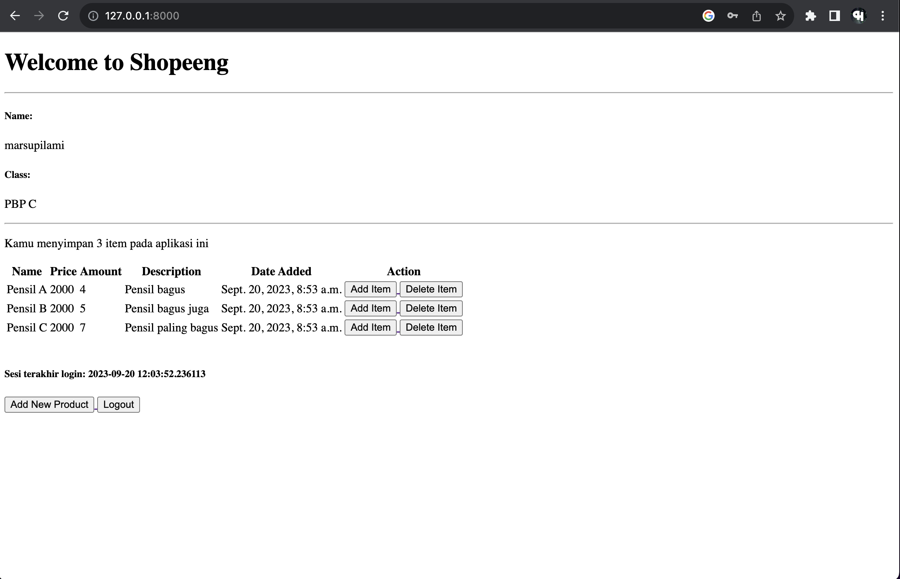

# Shopeeng

<hr>

# Tugas 2

1. Membuat virtual environment dengan perintah
   ```
   python -m venv env
   ```
3. Masuk ke dalam virtual environment dengan perintah
   ```
   source env/bin/activate
   ```
5. Menginstall beberapa add on pada django dengan menggunakan requirements.txt yang berisi
```
  django
  gunicorn
  whitenoise
  psycopg2-binary
  requests
  urllib3
```
  Kemudian menginstall requirements dengan perintah
  ```
  pip install -r requirements.txt
```
7. Membuat project django
   ```
   django-admin startproject shopeeng .
   ```
9. Untuk keperluan deployment diperlukan menambahkan "*" di setting.py pada Allowed Host
    ```
    ALLOWED_HOSTS = ["*"]
    ```
11. Membuat app dengan nama main
```
   python manage.py startapp main
```
13.Membuat routing agar dapat melakukan routing ke aplikasi main dari root URL
```
from django.contrib import admin
from django.urls import path, include


urlpatterns = [
    path('admin/', admin.site.urls),
    path('main/', include('main.urls')),
]
```
   - menambahkan include dan path 'main/'.
14. Membuat model pada folder main, seperti berikut
```
from django.db import models

class Item(models.Model):
    name = models.CharField(max_length=255)
    amount = models.IntegerField()
    price = models.IntegerField()
    description = models.TextField()
```
15. Menambahkan method show_main pada views.py pada folder main untuk mengatasi request yang masuk ketika URL dihit
```
from django.shortcuts import render
def show_main(request):
    context = {
        'name': 'Faris Zhafir Faza',
        'class': 'PBP C'
    }

    return render(request, "main.html", context)
```
   - context berisi nama dan kelas yang kemudian mengembalikan context dan juga main.html untuk merespon request dengan suatu halaman website

16.  Membuat urls.py pada folder main untuk keperluan routing dengan isi berikut
```
from django.urls import path
from main.views import show_main

app_name = 'main'

urlpatterns = [
    path('', show_main, name='show_main'),
]
```
  - Melakukan import show_main dari main.views. show_main nantinya akan diimplementasikan pada tahap selanjutnya untuk menampilkan apa yang akan di tampilkan jika kita berada pada url 'main/'.
  - app_name merupakan nama unik yang akan menjadi pola URL aplikasi
17. Melakukan deployment di adaptable

Bagan Hubungan antara views, urls, models, dan berkas html


- Jelaskan mengapa kita menggunakan virtual environment? Apakah kita tetap dapat membuat aplikasi web berbasis Django tanpa menggunakan virtual environment?
   Menggunakan virtual environment sangatlah penting karena dengan adanya virtual environment, project django akan lebih stabil, mudah direproduksi, dan bersifat portable. Adanya virtual environment juga membuat project django kita terpisah atau dengan kata lain, project yang dibuat terisolasi agar tidak mengganggu proyek yang lain. Pembuatan proyek django tanpa menggunakan virtual environment tetap bisa dilakukan, tetapi jika tidak menggunakan virtual environment kemungkinan akan terjadi konflik antara proyek django.

- Jelaskan apakah itu MVC, MVT, MVVM dan perbedaan dari ketiganya
   - MVC (Model-View-Controller):
     
   Model: Merupakan komponen yang mengatur data dan logika bisnis.
   View: Bertanggung jawab untuk menampilkan tampilan yang diberikan kepada pengguna.
   Controller: Bertindak sebagai perantara antara model dan view.
   
   - MVT (Model-View-Template):

   Model: Merupakan komponen yang mengatur data dan logika bisnis.
   View: Menangani tampilan yang diberikan kepada pengguna.
   Template: Komponen yang mengelola tampilan HTML atau template yang disajikan kepada pengguna.

   - MVVM (Model-View-ViewModel):

   Model: Merupakan komponen yang mengatur data dan logika bisnis.
   View: Ini adalah tampilan yang diberikan kepada pengguna.
   ViewModel: Komponen yang berfungsi sebagai perantara antara model dan view. ViewModel mengubah data dari model ke format yang sesuai       untuk tampilan.

Perbedaan utama antara ketiga pendekatan ini terletak pada cara mereka mengatur dan mengelola komunikasi antara model, tampilan, dan logika pengendali. MVC adalah pola desain yang lebih tua dan umumnya digunakan dalam pengembangan berbasis server, sedangkan MVT adalah MVC, tetapi memiliki perbedaan beberapa nama untuk beberapa komponen. MVVM adalah pola yang lebih modern dan umumnya digunakan dalam pengembangan aplikasi berbasis klien (seperti aplikasi web dengan JavaScript) untuk mengelola tampilan dan interaksi pengguna.

<hr>

# TUGAS 3

1. Apa perbedaan antara form POST dan form GET dalam Django?
   
   form POST adalah method untuk mengirim suatu data ke dalam database, sedangkan form GET adalah method untuk mendapatkan data dari database.

2. Apa perbedaan utama antara XML, JSON, dan HTML dalam konteks pengiriman data?

   JSON: JSON sangat mudah untuk dimengerti. JSON digunakan pada banyak aplikasi web maupun mobile, yaitu untuk menyimpan dan mengirimkan data. Format JSON berbentuk text sehingga kode untuk membaca dan membuat JSON banyak terdapat dibanyak bahasa pemrograman.

   XML: XML adalah self-descriptive, jadi dengan membaca XML tersebut kita bisa mengerti informasi apa yang ingin disampaikan dari data yang tertulis. XML digunakan pada banyak aplikasi web maupun mobile, yaitu untuk menyimpan dan mengirimkan data. XML berisi informasi yang dibungkus di dalam tag.
   
   HTML: HTML digunakan untuk menampilkan informasi dalam bentuk halaman web yang dapat dilihat oleh pengguna akhir. Ini adalah format yang digunakan untuk merender tampilan dan konten dalam browser web. HTML bukan format yang cocok untuk pertukaran data struktural, tetapi lebih untuk presentasi dan tampilan.

3. Mengapa JSON sering digunakan dalam pertukaran data antara aplikasi web modern?

   Karena JSON didesain menjadi self-describing, sehingga JSON sangat mudah untuk dimengerti, selain itu JSON berbentuk text, sehingga kode untuk membaca dan membuat JSON banyak terdapat dibanyak bahasa pemrograman

<hr>

### Jelaskan bagaimana cara kamu mengimplementasikan checklist di atas secara step-by-step (bukan hanya sekadar mengikuti tutorial)

1. Membuat file forms.py pada folder main untuk membuat struktur form.
```
from django.forms import ModelForm
from main.models import Item

class ItemForm(ModelForm):
    class Meta:
        model = Item
        fields = ["name", "price", "amount", "description"]

```
```model = Item ```
artinya adalah model yang dipakai adalah model Item. Fields menunjukan apa saja yang akan menjadi input user. date_add tidak ditambahkan karena dari models, date_add sudah di auto ditambahkan saat item tersebut dibuat.

2. Mengimport beberapa moddule dan juga membuat fungsi untuk menghasilkan form yang dapat menambahkan item saat button submit ditekan
```
from django.http import HttpResponseRedirect
from main.forms import ProductForm
from django.urls import reverse

def create_item(request):
    form = ItemForm(request.POST or None)

    if form.is_valid() and request.method == "POST":
        form.save()
        return HttpResponseRedirect(reverse('main:show_main'))

    context = {'form': form}
    return render(request, "create_item.html", context)

```
```form = ItemForm(request.POST or None)``` artinya dalah membuat ItemForm baru berdasarkan input dari user. Kemudian form yang telah diisi akan dicek kevalidnya, jika form yang diisi valid dan requestnya adalah POST, maka form yang telah diisi akan disave dan akan langsung redirect ke page root.

4. Menambah dua line kode di method show_main pada views.py
```
def show_main(request):
    items = Item.objects.all() # menambah kode ini
    total_items = Item.objects.count()
    context = {
        'name': 'Faris Zhafir Faza',
        'class': 'PBP C',
        'items' : items, # menambah kode ini
        'total_items' : total_items
    }

    return render(request, "main.html", context)
```
```items = Item.objects.all()``` berfungsi untuk mendapatkan semua item yang disimpan dalam Item, ```'items' : items,``` mengeset variable items yang mempunyai isi items di dalam context yang kemudian dikirim ke main.html.

5. Membuat create_item.html untuk halaman pada saat menambahkan item.
```
 


<h1>Add New Item</h1>

<form method="POST">
    
    <table>
        {{ form.as_table }}
        <tr>
            <td></td>
            <td>
                <input type="submit" value="Add Item"/>
            </td>
        </tr>
    </table>
</form>


```
method = "POST" mengindikasikan bahwa form digunakan saat request berjenis POST. csrf_token adalah token untuk security dan form.as_table adalah menampilkan forms yang telah dibuat pada forms.py. Tag input adalah tombol input yang jika ditekan akan mengirimkan request ke views.py dan masuk ke dalam create_item dengan parameter request yang berhasal dari input user.

6. Menambahkan button di root page agar dapat menambah item.
```
  <a href="">
      <button>
          Add New Product
      </button>
  </a>
```

7. Menambahkan url pada urls.py agar dapat menampilkan halaman saat membuat item.
```
path('create-item', create_item, name='create_item'),
```
kemudian mengimport create_item 

8. Menambahkan kode yang akan menampilkan item-item yang sudah pernah diinput.
```
   <table>
      <tr>
          <th>Name</th>
          <th>Price</th>
          <th>Amount</th>
          <th>Description</th>
          <th>Date Added</th>
      </tr>
  
    <hr>
      
      <p>Kamu menyimpan {{total_items}} item pada aplikasi ini</p>
      
          <tr>
              <td>{{item.name}}</td>
              <td>{{item.price}}</td>
              <td>{{item.amount}}</td>
              <td>{{item.description}}</td>
              <td>{{item.date_added}}</td>
          </tr>
      
  </table>
```

9. Membuat method show_xml untuk menampilkan item yang ada dengan format xml
```
def show_xml(request):
    data = Item.objects.all()
    return HttpResponse(serializers.serialize("xml", data), content_type="application/xml")
```
data akan berisi semua item yang ada yang kemudian mengirimkan response dengan format xml yang ditunjukkan 
dengan content-type yang sudah divalidasi.

10. Membuat method show_json untuk menampilkan item yang ada dengan format json
```
def show_json(request):
    data = Item.objects.all()
    return HttpResponse(serializers.serialize("json", data), content_type="application/json")
```
data akan berisi semua item yang ada yang kemudian mengirimkan response dengan format json yang ditunjukkan dengan content-type yang sudah divalidasi.

11. Membuat method show_json_by_id untuk menampilkan item yang ada dengan format json berdasarkan id dari item tersebut
```
def show_json_by_id(request, id):
    data = Item.objects.filter(pk=id)
    return HttpResponse(serializers.serialize("json", data), content_type="application/json")
```
Berbeda dari method show_json, method ini memerlukan tambahan parameter yaitu parameter id. Data akan berisi item dengan id, id didapatkan dari url, kemudian mengirimkan response dengan format json yang ditunjukkan dengan content-type yang sudah divalidasi.

12. Membuat method show_xml_by_id untuk menampilkan item yang ada dengan format xml berdasarkan id dari item tersebut
```
def show_xml_by_id(request, id):
    data = Item.objects.filter(pk=id)
    return HttpResponse(serializers.serialize("xml", data), content_type="application/xml")
```
Berbeda dari method show_xml, method ini memerlukan tambahan parameter yaitu parameter id. Data akan berisi item dengan id, id didapatkan dari url, kemudian mengirimkan response dengan format xml yang ditunjukkan dengan content-type yang sudah divalidasi.

13. Membuat method show_html untuk menampilkan item yang ada dengan format xml berdasarkan id dari item tersebut
```
def show_html(request):
    data = Item.objects.all()
    return render(request, 'items.html', {'items': data})
```
Berbeda dari method show_xml dan show_json, method ini memerlukan file html yang akan digunakan untuk menampilkan data yang telah dibungkus dengan html. Data akan berisi semua item, kemudian mengirimkan response dengan format html dengan mengirimkan variabel items yang berisi data.

14. Membuat file html untuk menampilkan data 

15. 
```
<!DOCTYPE html>
<html>
<head>
    <title>Items List</title>
</head>
<body>
    <h1>Items List</h1>
    <ul>
        
            <li>{{ item.name }} - {{ item.description }}</li>
        
    </ul>
</body>
</html>

```

16. Menambahkan route terhadap views yang telah dibuat
```
path('xml/', show_xml, name='show_xml'), 
path('html/', show_html, name='show_html'), 
path('json/', show_json, name='show_json'), 
path('xml/<int:id>/', show_xml_by_id, name='show_xml_by_id'),
path('json/<int:id>/', show_json_by_id, name='show_json_by_id'),
path('html/<int:id>/', show_html_by_id, name='show_html_by_id'),
```
Untuk path yang perlu mangambil value id (dynamic url) maka perlu ditambahkan '/<int:id>/'.

<hr>

Screenshot saat menembak url ``` http://localhost:8000/json```


Screenshot saat menembak url ``` http://localhost:8000/xml```


Screenshot saat menembak url ``` http://localhost:8000/html```


Screenshot saat menembak url ``` http://localhost:8000/html/1```


Screenshot saat menembak url ``` http://localhost:8000/xml/1```


<hr>

# TUGAS 4

1. Apa itu Django UserCreationForm, dan jelaskan apa kelebihan dan kekurangannya?<br>
Jawab: Django UserCreationForm adalah formulir bawaan django dalam pendaftaran pengguna dalam sebuah aplikasi web.
Kelebihan: Pengguna baru dapat mendaftar dengan mudah di aplikasi web tanpa menulis kode dari awal.
Kekurangan: Tampilan dari Django UserCreationForm kurang enak dilihat, banyak dari element atau text pada form tersebut masih sangat raw sehingga tampilanya kurang bagus.

2. Apa perbedaan antara autentikasi dan otorisasi dalam konteks Django, dan mengapa keduanya penting?
Jawab: Otentikasi bertujuan untuk memastikan identitas pengguna, sedangkan otorisasi bertujuan untuk menentukan hak akses pengguna terhadap fitur-fitur tertentu. Keduanya sangatlah penting karena berkaitan dengan keamanan data dan dapat mencegah terjadinya penyalahgunaan aplikasi.

3. Apa itu cookies dalam konteks aplikasi web, dan bagaimana Django menggunakan cookies untuk mengelola data sesi pengguna?
Jawab: Dalam konteks aplikasi web, cookies adalah file teks yang disimpan di browser pengguna dan digunakan untuk menyimpan informasi tentang penggunaan situs web. Cookies dapat digunakan untuk mengidentifikasi pengguna dan menyimpan data sesi pengguna. Django menggunakan cookies untuk mengelola data sesi pengguna. Ketika pengguna masuk ke situs web Django, Django akan membuat cookie yang berisi ID sesi unik untuk pengguna. Cookie ini kemudian dikirim ke browser pengguna dan disimpan di browser. Setiap kali pengguna melakukan permintaan ke situs web Django, cookie akan dikirim ke server Django bersama dengan request. Server Django kemudian menggunakan ID sesi yang terkandung dalam cookie untuk mengambil data sesi pengguna dari penyimpanan server.

4. Apakah penggunaan cookies aman secara default dalam pengembangan web, atau apakah ada risiko potensial yang harus diwaspadai?
Jawab: Tidak aman, cookies berisi data-data sensitif seperti informasi login, token otentikasi, atau informasi pribadi lainnya. Jika cookies tidak dienkripsi dengan benar maka akan timbul berbagai risiko, contohnya sebagai berikut:  
* Data tersebut bisa dicuri oleh pihak yang tidak berwenang.

* Kebocoran Data, Cookies dapat bocor jika tidak diatur dengan benar. Ada risiko potensial bahwa skrip yang berjalan di browser dapat mencuri informasi dari cookies, seperti token otentikasi.
* Kebocoran Informasi, Cookies dapat mengandung informasi penting yang dapat membocor jika tidak diatur dengan benar. Misalnya, jika cookies mengandung ID pengguna, ada risiko informasi ini bisa dicuri.

#### Jelaskan bagaimana cara kamu mengimplementasikan checklist di atas secara step-by-step (bukan hanya sekadar mengikuti tutorial).

1. Membuat Registration Form
    #### - Melakukan import pada views.py yang terletak pada folder main
    ```
        from django.shortcuts import redirect
        from django.contrib.auth.forms import UserCreationForm
        from django.contrib import messages  
    ```
    ```redirect``` digunakan untuk mendirect ke halaman atau page tertentu.
    ```UserCreationForm``` adalah form otomatis yang telah dibuat oleh django.
    ```messages``` digunakan untuk mengirimkan message jika sudah berhasil mendaftar pada login page
    #### - Menambahkan fungsi ```register``` pada views.py yang digunakan untuk pendaftaran akun
    ```
    def register(request):
    form = UserCreationForm()

    if request.method == "POST":
        form = UserCreationForm(request.POST)
        if form.is_valid():
            form.save()
            messages.success(request, 'Your account has been successfully created!')
            return redirect('main:login')
    context = {'form':form}
    return render(request, 'register.html', context)
    ```
    ```form = UserCreationForm()``` adalah mengassign form yang telah dibuat oleh java yang kemudian jika request yang masuk adalah POST, berarti form akan diberikan parameter request.POST. Request POST digunakan karena register pada dasarnya adalah membuat sebuah User. Jika form sudah diisi dan divalidasi maka form akan disave dan kemudian akan mengirimkan messages success yang kemudian web akan menuju ke halaman login. 
    
    #### - Membuat tampilan untuk register. 
    ```
    

    
        <title>Register</title>
    

      

    <div class = "login">
    
    <h1>Register</h1>  

        <form method="POST" >  
              
            <table>  
                {{ form.as_table }}  
                <tr>  
                    <td></td>
                    <td><input type="submit" name="submit" value="Daftar"/></td>  
                </tr>  
            </table>  
        </form>

      
        <ul>   
              
                <li>{{ message }}</li>  
                  
        </ul>   
    

    </div>  

    
    ```
    #### - Menambahkan path untuk register.
    Di dalam urls.py pada main, diperlukan untuk mengimport method register agar method tersebut dapat dipanggil di urls.py.
    ```
    from main.views import ....., register
    ```
    Kemudian menambahkan path register ke dalam url patterns
    ```
    path('register/', register, name='register'), 
    ```

2. Membuat Login Form
    #### - Melakukan import pada views.py yang terletak pada folder main.
    ```
    from django.contrib.auth import authenticate, login
    ```
    ```authenticate``` digunakan untuk melakukan autentikasi user dan ```login``` digunakan untuk login jika berhasil di autentikasi oleh sistem.
    #### - Menambahkan method login_user pada views.py.
    ```
    def login_user(request):
    if request.method == 'POST':
        username = request.POST.get('username')
        password = request.POST.get('password')
        user = authenticate(request, username=username, password=password)
        if user is not None:
            login(request, user)
            return redirect('main:show_main')
        else:
            messages.info(request, 'Sorry, incorrect username or password. Please try again.')
    context = {}
    return render(request, 'login.html', context)
    ```
    Method tersebut melakukan method get untuk mendapatkan value dari username dan password dari form yang diisi oleh user. Kemudian method melakukan autentikasi, apakah ada user dengan username dan password yang diberikan. Value dari autentikasi tersebut dipass ke variabel user yang kemudian dicek, jika ada user tersebut maka user tersebut dapat masuk ke halaman main dan jika tidak, maka page akan menampilkan message yang berisi gagal login. 
    #### - Membuat tampilan login page.
    ```
    

    
        <title>Login</title>
    

    

    <div class = "login">

    <h1>Login</h1>

    <form method="POST" action="">
        
        <table>
            <tr>
                <td>Username: </td>
                <td><input type="text" name="username" placeholder="Username" class="form-control"></td>
            </tr>
                    
            <tr>
                <td>Password: </td>
                <td><input type="password" name="password" placeholder="Password" class="form-control"></td>
            </tr>

            <tr>
                <td></td>
                <td><input class="btn login_btn" type="submit" value="Login"></td>
            </tr>
        </table>
    </form>

    
        <ul>
            
                <li>{{ message }}</li>
            
        </ul>
         
        
    Don't have an account yet? <a href="">Register Now</a>

    </div>

    
    ```
    #### - Menambahkan Path untuk login_user.
    Di dalam urls.py pada main, diperlukan untuk mengimport method login_user agar method tersebut dapat dipanggil di urls.py.
    ```
    from main.views import ....., login_user
    ```
    Kemudian menambahkan path register ke dalam url patterns
    ```
    path('login/', login_user, name='login'),
    ```
3. Membuat Fungsi Logout
    #### - Melakukan import pada views.py yang terletak pada folder main.
    ```
    from django.contrib.auth import logout
    ```
    #### - Menambahkan method logout_user pada views.py.
    ```
    def logout_user(request):
        logout(request)
        return redirect('main:login')
    ```
    ```logout(request)``` digunakan untuk mengambil sesi user saat ini, kemudian menghapus sesinya yang kemudian kembali ke halaman login
    #### -  Menambahkan Button Logout pada tampilan main.
    ```
    <a href="">
        <button>
            Logout
        </button>
    </a>
    ```
    Saat button logout diclick, maka akan langsung menjalankan method logout_user yang berada di views.py
    #### - Menambahkan Path untuk logout_user.
    Di dalam urls.py pada main, diperlukan untuk mengimport method logout_user agar method tersebut dapat dipanggil di urls.py.
    ```
    from main.views import ....., logout_user
    ```
    Kemudian menambahkan path register ke dalam url patterns
    ```
    path('logout/', logout_user, name='logout'),
    ```
4. Restriksi Pengguna
    Agar pengguna yang belum terautentikasi tidak dapat masuk ke halaman main, kita perlu melakukan restriksi pengguna. 

    #### - Mengimport login_required
    ```
    from django.contrib.auth.decorators import login_required
    ```
    ```login_required``` digunakan untuk mencegah pengguna asing yang ingin mengakses suatu page, pengguna asing tersebut harus login terlebih dahulu jika ingin mengaksesnya. Penggunaanya adalah cukup menambahkan baris 
    ```
    @login_required(login_url='/login')
    ```
    di atas method yang ingin direstriksi.

5. Membuat dummy akun dan disetiap akun tersebut terdapat tiga dummy item.
    #### - Membuat akun
    Membuat akun dengan melakukan registrasi sebanyak dua kali untuk membuat dua dummy user.
    #### - Menambahkan dummy item di setiap akun
    Menambahkan tiga item di setiap akun.

    Akun pertama 
        
    Akun kedua
        
6. Menghubungkan model Item dengan User.
    #### - Mengimport model User
    ```
    from django.contrib.auth.models import User
    ```
    #### - Menambahkan variabel user pada model Item
    ```
    user = models.ForeignKey(User, on_delete=models.CASCADE)
    ```
    Mengubungkan satu item dengan satu user pada model Item dan biasa disebut one to one relationship
    #### - Memodifikasi method create_item
    ```
    ...
    if form.is_valid() and request.method == "POST":
     item = form.save(commit=False)
     item.user = request.user
     item.save()
     return HttpResponseRedirect(reverse('main:show_main'))
    ...
    ```
    ```commit=False``` digunakan untuk mencegah Django langsung menyimpan objek yang dibuat ke database. Kemudian ```item.user = request.user``` berarti item yang dibuat merupakan milik user yang sedang login.
    #### - Memodifikasi method show_main
    ```
    ...
    items = Item.objects.filter(user=request.user)
    total_items = Item.objects.filter(user=request.user).count()
    context = {
        'name': request.user.username,
        ...
    ...
    ```
    ```items = Item.objects.filter(user=request.user)``` item yang ditampilkan pada main page merupakan item kepimilikan dari user yang sedang login. Maka dari itu, item di filter berdasarkan user. ```'name': request.user.username,``` mendapatkan nama dari user yang sekarang sudah login.
    #### - Melakukan migrasi 
    Migrasi diperlukan karena kita mengubah models.py

7. Menampilkan detail informasi pengguna yang sedang logged in seperti username dan menerapkan cookies seperti last login pada halaman utama aplikasi. 
    #### - Mengimpor beberapa package
    ```
    import datetime
    from django.http import HttpResponseRedirect
    ```
    ```datetime``` digunakan untuk mengambil waktu.
    #### - Mengganti kode yang ada pada blok ```if user is not None```
    ```
    ...
    if user is not None:
        login(request, user)
        response = HttpResponseRedirect(reverse("main:show_main")) 
        response.set_cookie('last_login', str(datetime.datetime.now()))
        return response
    ...
    ```
    User melakukan login terlebih dahulu. Kemudian membuat response dengan variabel response yang juga mendirect user ke halaman main. Kemudian ```response.set_cookie('last_login', str(datetime.datetime.now()))```  berguna untuk membuat last_login pada cookie dengan waktu saat login. 
    #### - Mengubah context pada method show_main
    ```
    ...
    'last_login': request.COOKIES['last_login'],
    ...
    ```
    tambahan line tersebut berfungsi menambahkan informasi cookie last_login pada response yang akan ditampilkan di halaman web.
    #### - Mengubah main.html untuk menambahkan informasi last login
    ```
    ...
    <h5>Sesi terakhir login: {{ last_login }}</h5>
    ...
    ```
    last_login didapatkan dari context pada show_main
    
<hr>

# Tugas 5

1. Jelaskan manfaat dari setiap element selector dan kapan waktu yang tepat untuk menggunakannya. 
Jawab: 
   - Universal Selector:
     - Manfaat: Memilih semua elemen dalam dokumen HTML.
     - Biasanya digunakan untuk memberikan style dasar atau reset CSS di seluruh dokumen, tetapi penggunaan berlebihan dapat mempengaruhi kinerja.
   - Type Selector:
     - Manfaat: Memilih semua elemen dengan tipe tertentu (misalnya, ```<p>, <h1>, <div>```) dalam dokumen.
     - Biasanya digunakan saat ingin memberikan style untuk semua elemen dengan tipe tertentu.
   - Class Selector:
     - Manfaat: Memilih semua elemen yang memiliki atribut class dengan nilai tertentu.
     - Berguna saat ingin memberikan style yang sama untuk beberapa elemen yang memiliki kelas yang sama.
   - ID Selector:
     - Manfaat: Memilih elemen dengan atribut id tertentu, yang harus unik dalam satu halaman HTML.
     - Berguna saat ingin memberikan style untuk elemen tunggal dengan id tertentu.
   - Descendant Selector (Selektor Turunan):
     - Manfaat: Memilih elemen yang merupakan turunan dari elemen lain.
     - Berguna saat ingin memberikan style yang berada dalam elemen lain, terutama jika ingin membatasi seleksi hanya pada elemen tertentu dalam hirarki dokumen.
   - Child Selector:
     - Manfaat: Memilih elemen yang menjadi child dari elemen lain.
     - Digunakan saat ingin memilih elemen yang adalah child dari elemen lain dalam hirarki.
   - Adjacent Sibling Selector:
     - Manfaat: Memilih elemen yang selevel dengan elemen lain dan memiliki elemen yang sama parent.
     - Berguna saat ingin memberikan style untuk elemen yang berdekatan secara langsung dengan elemen lain.
   - Attribute Selector :
     - Manfaat: Memilih elemen dengan atribut atau atribut tertentu dengan nilai tertentu.
     - Digunakan saat ingin memberikan style berdasarkan atribut atau nilai atribut elemen.

2. Jelaskan HTML5 Tag yang kamu ketahui.
Jawab: 
- ```<nav>```: Mengidentifikasi elemen sebagai menu navigasi untuk situs web atau bagian halaman tertentu. Ini dapat berisi tautan menu atau elemen-elemen navigasi lainnya.
- ```<div```: Digunakan untuk mengelompokkan dan mengorganisasi elemen-elemen HTML dalam satu blok kontainer.
- ```<p>```: Digunakan untuk menampilkan teks paragraf atau konten teks yang terstruktur.
- ```<ul>```:  Digunakan untuk membuat daftar yang tidak memiliki urutan tertentu. Biasanya digunakan dengan elemen ```<li>```.
- ```<li>```: Digunakan dalam elemen ```<ul>``` atau ```<ol>``` untuk mendefinisikan item dalam daftar.
- ```<span>```: Digunakan untuk mengelompokkan elemen teks atau inline lainnya dalam dokumen dan memberikan style.
- ```<h>```: (```<h1>``` hingga ```<h6>```) digunakan untuk menandai tingkat hierarki judul dalam dokumen, dengan `<h1>` menjadi judul utama dan `<h6>` menjadi judul terendah.
- ```<table>```: digunakan untuk membuat tabel dalam dokumen, yang terdiri dari baris dan kolom.
- ```<form>```: digunakan untuk membuat formulir yang memungkinkan pengguna untuk mengirim data ke server.

3. Jelaskan perbedaan antara margin dan padding
Jawab: 
- Margin:
Margin adalah ruang di luar batas luar elemen, yaitu jarak antara elemen dan elemen-elemen lain di sekitarnya.
Margin dapat digunakan untuk mengatur jarak antara elemen dengan elemen lain di luarnya sehingga memengaruhi tata letak elemen tersebut terhadap elemen-elemen tetangganya.
- Padding:
Padding adalah ruang di antara batas elemen dan konten di dalamnya, yaitu jarak antara batas dalam elemen dan kontennya sendiri.
Padding digunakan untuk mengatur jarak antara konten elemen dan batas elemen itu sendiri.
   
4. Jelaskan perbedaan antara framework CSS Tailwind dan Bootstrap. Kapan sebaiknya kita menggunakan Bootstrap daripada Tailwind, dan sebaliknya
Jawab: 
- Tailwind CSS: Framework CSS yang memiliki pendekatan "utility-first." yang artinya membangun tampilan dengan menggabungkan kelas-kelas kecil yang mewakili properti CSS, seperti mb-4 untuk margin bawah atau text-red-500 untuk warna teks merah. Sebaiknya kita menggunakan tailwind jika kita ingin kontrol yang lebih besar pada setiap properti CSS dan tampilan yang sangat disesuaikan atau ingin membangun tampilan dengan cepat menggunakan kelas-kelas utilitas.
- Bootstrap: Bootstrap memiliki desain yang lebih "opinionated" dengan komponen-komponen yang telah dirancang sebelumnya. Kita lebih banyak menggunakan kelas komponen daripada mengatur properti CSS satu per satu. Sebaiknya kita menggunakan bootstrap jika kita ingin cepat membangun tampilan dengan komponen-komponen yang sudah dirancang sebelumnya atau tidak memiliki banyak pengalaman dalam penyesuaian tampilan dengan CSS atau ingin menghindari pengetikan CSS yang berlebihan

# Jelaskan bagaimana cara kamu mengimplementasikan checklist di atas secara step-by-step

1. Menginstal tailwind di django dengan mengikuti link https://django-tailwind.readthedocs.io/en/latest/installation.html
2. Kustomisasi halaman login, register, dan tambah inventori semenarik mungkin. 
- ```login.html```
```html



    <title>Login</title>





<div class = "login w-full mt-20 max-h-screen flex justify-center content-center">
    <div class="bg-slate-100 py-10 px-20 m-4 w-auto rounded-lg shadow-xl">
        <h1 class="text-5xl font-extrabold mt-4 mb-6">Login</h1>
        <form method="POST" action="" class="my-4">
            
            <div class="mb-6">
              <label for="text" class="block mb-2 text-sm font-medium text-gray-900">Username</label>
              <input  type="text" name="username" class="form-control shadow-sm bg-gray-50 border border-gray-300 text-gray-900 text-sm rounded-lg focus:ring-blue-500 focus:border-blue-500 block w-full p-2.5" placeholder="Username" required>
            </div>
            <div class="mb-6">
              <label for="password" class="block mb-2 text-sm font-medium text-gray-900">Password</label>
              <input type="password" name="password" class="form-control shadow-sm bg-gray-50 border border-gray-300 text-gray-900 text-sm rounded-lg focus:ring-blue-500 focus:border-blue-500 block w-full p-2.5" placeholder="Password" required>
            </div>
            <button type="submit" value="Login" class="btn login_btn text-white bg-blue-700 hover:bg-blue-800 focus:ring-4 focus:outline-none focus:ring-blue-300 font-medium rounded-lg text-sm px-5 py-2.5 text-center">Login</button>
          </form>   
            Don't have an account yet? <a class="text-blue-700 focus:ring-4 focus:ring-blue-300 font-medium rounded-lg text-sm" href="">Register</a>
        
            
                <p class="text-red-600">{{ message }}</p>
            
          
    </div>
</div>


```
- ```register.html```
```html



    <title>Register</title>


  


<div class = "login w-full mt-10 max-h-screen flex justify-center content-center">
    <div class="bg-slate-100 py-10 px-20 m-4 w-auto rounded-lg shadow-xl">
        <h1 class="text-5xl font-extrabold mt-4 mb-6">Register</h1>
        <form method="POST" >  
              
            
            <p class="my-2 flex flex-col">
                
                <ul class="errorlist">
                    
                    <li>{{ error }}</li>
                    
                </ul>
                
                <p class="block mb-2 text-sm font-medium text-gray-900">
                    {{ field.label_tag }}
                </p>
                <p class="shadow-sm bg-gray-50 border border-gray-300 text-gray-900 text-sm rounded-lg focus:ring-blue-500 focus:border-blue-500 block w-full p-2.5">
                    {{ field }}
                </p>
            </p>
            
            <input type="submit" name="submit" value="Daftar" class="btn login_btn text-white my-3 bg-blue-700 hover:bg-blue-800 focus:ring-4 focus:outline-none focus:ring-blue-300 font-medium rounded-lg text-sm px-5 py-2.5 text-center"/>
        </form> 
            Have an account? <a class="text-blue-700 focus:ring-4 focus:ring-blue-300 font-medium rounded-lg text-sm" href="">Sign In</a>
        
            
                <p class="text-red-600">{{ message }}</p>
            
          
    </div>
</div>


```
- ```create_item.html```
```html
 



<div class="px-4">
    <h1 class="text-5xl font-extrabold my-4">Add New Item</h1>

    <form method="POST">
        
        <table>
            {{ form.as_table }}
            <tr>
                <td></td>
                <td>
                    <input type="submit" value="Add Item" class="btn btn-primary text-white bg-blue-700 hover:bg-blue-800 focus:ring-4 focus:ring-blue-300 font-medium rounded-lg text-sm p-3.5 mr-2 mb-2 focus:outline-none"/>
                    <a href="/">
                        <button type="button" class="focus:outline-none text-white bg-red-700 hover:bg-red-800 focus:ring-4 focus:ring-red-300 font-medium rounded-lg text-sm p-3.5 mr-2 mb-2">
                            Cancel
                        </button>
                    </a>
                </td>
            </tr>
        </table>
    </form>
</div>

```
3.  Kustomisasi halaman daftar inventori menjadi lebih berwarna maupun menggunakan apporach lain seperti menggunakan Card. 

- Melakukan kostumisasi pada tampilan utama dengan menerapkan card untuk menampung barang dan menerapkan warna transparant untuk item yang berbeda.

- ```main.html```
```html






<div class="px-4 ">
    <h1 class="text-4xl my-7 ml-7 font-bold font-sans">Hello {{ name}} from {{ class}}!</h1>
    <div class="flex justify-between">
        
            <h1 class="font-extrabold text-5xl text-black">Daftar Barang</h1>
        
        <h1 class="font-extrabold text-5xl text-black">Tambah Barang Dulu Yukk</h1>
        
        <a href="" class="flex w-fit justify-self-end text-white bg-blue-700 hover:bg-blue-800 focus:ring-4 focus:ring-blue-300 font-medium rounded-lg text-sm p-4 mr-2 mb-2 focus:outline-none">
            <button>
              Add New Product
            </button>
        </a>
    </div>
    <div class="flex flex-wrap justify-center">
        
        <div class="w-[300px] m-4 h-[350px] p-6  bg-transparent bg-white border border-gray-200 rounded-lg shadow-xl">
            <div class="flex justify-between">
                <h5 class="mb-2 text-xl font-bold tracking-tight text-gray-900 ">{{item.name}}</h5>
                <form action="" method="post">
                    
                    <button type="submit" name="Remove" class="btn btn-danger focus:outline-none text-white bg-red-600 hover:bg-red-800 focus:ring-4 focus:ring-red-300 font-medium rounded-lg text-sm px-2 py-1.5 mb-2">Delete</button>
                </form>
            </div>
            <div class="bg-slate-500 h-[150px]"> h </div>
            <p class="my-3 font-normal text-gray-700 ">{{item.description}}</p>
            <div class="flex justify-between">
                <p class="text-xl font-bold text-gray-900 ">Rp.{{item.price}}</p>
                <a>{{item.amount}} items</a>
            </div>
            <div class="flex justify-end">
                <form action="" method="post">
                    
                    <button type="submit" name="Increment" class="btn btn-primary text-white bg-blue-700 hover:bg-blue-800 focus:ring-4 focus:ring-blue-300 font-medium rounded-lg text-sm px-2 py-1.5 mr-2 mb-2 focus:outline-none">+</button>
                    </form>
                <form action="" method="post">
                    
                    <button type="submit" name="Decrement" class="focus:outline-none text-white bg-red-700 hover:bg-red-800 focus:ring-4 focus:ring-red-300 font-medium rounded-lg text-sm px-2 py-1.5 mr-2 mb-2">-</button>
                </form>
            </div>
        </div>
        
    </div>
    <h5 class="mt-4">Sesi terakhir login: {{ last_login }}</h5>
</div>
    

```
- ``` bg-transparent bg-white``` menambahkan pada class agar ketika item tersebut adalah item yang terakhir, warnanya berbeda dengan barang yang lain.